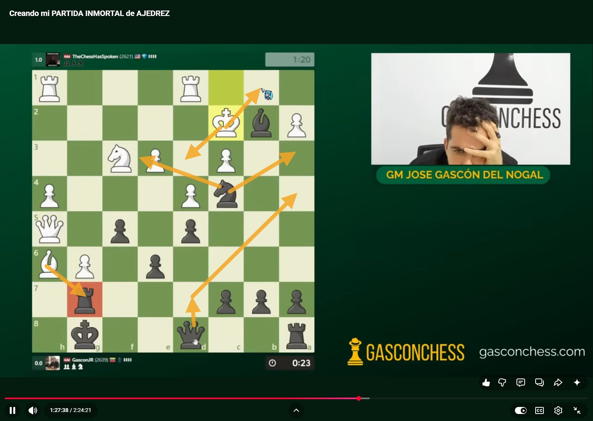

# ♟️ Chess Arrows for YouTube

A Chrome extension that lets you draw chess-style arrows over any YouTube video — just like on Chess.com.

Perfect for following along with chess content creators without losing track of the moves you're calculating.



---

## ✨ Features

- **Right-click + drag** → draws a yellow arrow over the video
- **Release right-click** → the arrow stays on screen
- **Draw as many arrows as you want**
- **Left-click the video** → clears all arrows (next left-click plays/pauses normally)
- Works on any YouTube video, not just chess

---

## 🚀 Installation

> The extension is not on the Chrome Web Store. Install it manually in a few steps:

1. **Download** this repository (Code → Download ZIP) and unzip it
2. Open Chrome and go to `chrome://extensions`
3. Enable **Developer mode** (top-right toggle)
4. Click **"Load unpacked"** and select the unzipped folder
5. The extension icon will appear in your Chrome toolbar — done!

---

## 🎮 How to use

| Action | Result |
|---|---|
| Right-click + drag on the video | Draw a yellow arrow |
| Release right-click | Arrow stays fixed |
| Right-click + drag again | Add another arrow |
| Left-click the video (with arrows) | Clears all arrows |
| Left-click the video (no arrows) | Play / Pause (normal) |

---

## 🛠️ Development

No build step needed — pure vanilla JS.

```
chess-arrows-extension/
├── manifest.json   # Chrome extension config
├── content.js      # All the logic (SVG overlay + event handling)
├── icon.png        # Extension icon
└── README.md
```

To modify and reload: edit `content.js`, then click the refresh icon on `chrome://extensions`.

---

## 📄 License

MIT — do whatever you want with it.
